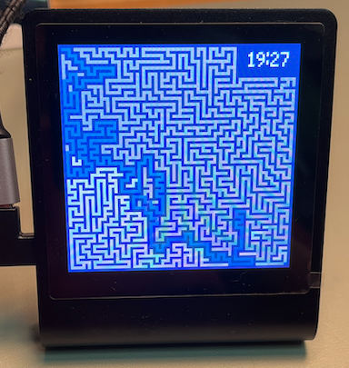

# Presto Maze

A maze generation and solving application for the Pimoroni Presto device. This project creates random mazes, displays them on the Presto screen, and animates the solving process.




## Overview

This application uses a depth-first search algorithm to generate random mazes and then solves them using a pathfinding algorithm. The maze is displayed on the Presto's screen with a clock shown in the top-right corner.

## Files

### main.py

The main application file containing the core functionality:

- **MazeGenerator**: Creates random mazes using a depth-first search algorithm
  - Generates a maze with walls and paths
  - Creates an empty space in the top-right corner for displaying a clock
  - Sets start and goal positions

- **MazeSolver**: Solves the generated maze
  - Uses a pathfinding algorithm to find a route from start to goal
  - Animates the solving process on the display
  - Tracks visited cells and the final solution path

- **MazeDisplay**: Handles all display-related functions
  - Draws the maze on the Presto screen
  - Shows the clock in the top-right corner
  - Provides visual feedback during maze solving
  - Animates the solution path

- **Main Function**: Controls the program flow
  - Generates a new maze
  - Displays the maze
  - Solves the maze
  - Animates the solution
  - Waits for a specified time before generating a new maze

### config.py

Configuration settings for the application:

- `GMT_OFFSET`: Time zone offset (default: 9 for Tokyo)
- `MAZE_WIDTH`: Width of the maze (default: 19)
- `MAZE_HEIGHT`: Height of the maze (default: 19)
- `HAS_WIFI`: Flag to enable/disable WiFi connection (default: True)
- `NEXT_SLEEP`: Time to wait before generating a new maze (default: 6 seconds)

## Features

- **Random Maze Generation**: Creates unique mazes each time
- **Interactive Display**: Touch the screen to change maze size (19×19, 33×33, 79×79, 119×119)
- **Real-time Clock**: Displays current time in the top-right corner with automatic synchronization via WiFi
- **Animated Solving**: Visualizes the maze-solving process
- **Configurable Settings**: Easily adjust maze size, time zone, and other parameters

## Setup

1. **Prepare your Pimoroni Presto device**:
   - Make sure your Presto device has MicroPython installed with the Presto library
   - Connect your Presto device to your computer via USB

2. **Configure WiFi and settings**:
   - Open `config.py` in a text editor
   - Set your local time zone by adjusting `GMT_OFFSET` (default: 9 for Tokyo)
   - Adjust maze dimensions with `MAZE_WIDTH` and `MAZE_HEIGHT` if desired
   - Set `HAS_WIFI` to `True` if you want to use WiFi for time synchronization
   - Modify `NEXT_SLEEP` to change the wait time between maze generations

3. **Upload files to your Presto device**:
   - Open Thonny IDE
   - Connect to your Presto device
   - Upload both `main.py` and `config.py` to the root directory of your Presto device
   - Make sure both files are saved with their exact names

4. **Run the application**:
   - The application will start automatically when the Presto device boots
   - Alternatively, you can run it manually by executing `main.py` in Thonny

## Usage

1. Once the files are uploaded to your Pimoroni Presto device, the application will start automatically
2. The device will connect to WiFi (if `HAS_WIFI` is set to `True`) to synchronize time
3. Touch the screen to cycle through different maze sizes (19×19, 33×33, 79×79, 119×119):
   - Each touch will switch to the next size in sequence
   - The maze will be regenerated with the new size immediately
   - Larger mazes are more complex and take longer to solve
4. The application will generate, solve, and display new mazes continuously
5. The current time will be displayed in the top-right corner of the screen:
   - Time is automatically synchronized via WiFi (if enabled)
   - The clock continues to update even during maze generation and solving

## Requirements

- Pimoroni Presto device
- MicroPython with the Presto library
- WiFi connection (for time synchronization, optional if `HAS_WIFI` is set to `False`)

## Customization

You can customize the application by modifying the `config.py` file:

- **Time Zone**: Set your local time zone with `GMT_OFFSET` (default: 9 for Tokyo)
  ```python
  # Example: Set to London time (GMT+0)
  GMT_OFFSET = 0
  ```

- **Maze Dimensions**: Change the maze size by adjusting `MAZE_WIDTH` and `MAZE_HEIGHT`
  ```python
  # Example: Create a larger maze
  MAZE_WIDTH = 33
  MAZE_HEIGHT = 33
  ```
  Note: The application supports sizes 19×19, 33×33, 79×79, and 119×119, which can be cycled through by touching the screen

- **WiFi Connection**: Enable or disable WiFi for time synchronization
  ```python
  # Example: Disable WiFi connection
  HAS_WIFI = False
  ```

- **Wait Time**: Adjust the wait time between maze generations with `NEXT_SLEEP`
  ```python
  # Example: Wait 10 seconds between mazes
  NEXT_SLEEP = 10
  ```

All changes to `config.py` take effect after restarting the Presto device or rerunning the application.